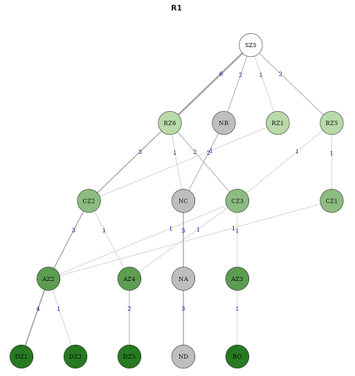

# VolleyK1@ppnalyzer

## 🌐 Online access to VolleyK1@ppnalyzer

[VolleyK1@ppnalyzer v1.0](https://raul-datexbio.shinyapps.io/VolleyK1appnalyzer/)

## 📝 About VolleyK1@ppnalyzer

VolleyK1@ppnalyzer is a free, interactive web application developed with R Studio and Shiny. This innovative tool is designed to analyze the **complex 1 or side-out phase (K1) in volleyball matches** 🏐, either in person or remotely via YouTube videos 📹.

VolleyK1@ppnalyzer is the world’s first application 🌍 that enables real-time construction of **social network graphs** 👥, visualizing how the K1 game’s actions in a volleyball match are spatially interrelated. Additionally, it’s the first app to allow real-time calculation of **attack zone transition probabilities** 🔄 and post-match **multiple correspondence analysis (MCA)** 📊 for volleyball data.

<strong>Figure 1.</strong> <em>Example of Social Network Analysis in rotation 1 of the analyzed team</em>

  

## 💡 Future features and ideas for VolleyK1@ppnalyzer

In future versions of VolleyK1@ppnalyzer, we are considering adding the following features:

- **📊 Social network visualization on volleyball court**: visualize the social network graph directly within a volleyball court layout to facilitate the interpretation of the results.
- **⏱️ Enhanced real-Time interactivity**: develop further real-time features to increase usability and responsiveness for users.

If you have any suggestions for improvement, feel free to share them in the **Discussions** section of our GitHub repository. 💬

To support the inclusion of these new features, contributions from app users through the **GitHub Sponsors crowdfunding campaign** are crucial. Thank you! 🙏

## 📝 About EasySportsApps project

VolleyK1@ppnalyzer is part of the [EasySportsApps](https://github.com/EasySportsApps) project, driven and developed by [Raúl Hileno, PhD](https://orcid.org/0000-0003-3447-395X). The project focuses on creating practical and innovative digital solutions that address the dynamic needs of professionals in physical activity and sports.

## 📜 VolleyK1@ppnalyzer license

VolleyK1@ppnalyzer is licensed under the Creative Commons Attribution-NonCommercial-NoDerivatives 4.0 International License ([CC BY-NC-ND 4.0](https://creativecommons.org/licenses/by-nc-nd/4.0/)).

You are free to:
- **🔗 Share** — Copy and redistribute the material in any medium or format.

Under the following terms:
- **📛 Attribution** — You must give appropriate credit, provide a link to the license, and indicate if changes were made. You may do so in any reasonable manner, but not in any way that suggests the licensor endorses you or your use.
- **🚫 NonCommercial** — You may not use the material for commercial purposes.
- **🚷 NoDerivatives** — If you remix, transform, or build upon the material, you may not distribute the modified material.
- **🔓 No additional restrictions** — You may not apply legal terms or technological measures that legally restrict others from doing anything the license permits.
